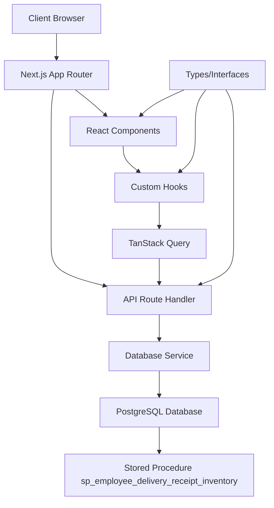

# Design Document

## Overview

Employee Delivery Receipt Inventory là một feature hiển thị thông tin theo dõi Giao/Nhận/Tồn kho cho từng nhân viên trong hệ thống sản xuất gia công. Feature này sử dụng stored procedure `sp_employee_delivery_receipt_inventory` để truy xuất dữ liệu và cung cấp giao diện web để xem, lọc và xuất báo cáo.

Hệ thống được thiết kế theo pattern hiện có của Yamato-SaaS với Next.js App Router, TypeScript, Tailwind CSS, và Shadcn/ui components.

## Architecture

### High-Level Architecture



### Data Flow

1. **User Interaction**: Người dùng tương tác với giao diện (filter, sort, search)
2. **State Management**: React hooks quản lý state và gọi API
3. **API Layer**: Next.js API routes xử lý request và gọi stored procedure
4. **Database Layer**: PostgreSQL thực thi stored procedure và trả về dữ liệu
5. **Response Processing**: Dữ liệu được format và trả về client
6. **UI Update**: Components được re-render với dữ liệu mới

## Components and Interfaces

### 1. Page Component
**File**: `src/app/[locale]/(auth)/dashboard/employee-delivery-receipt-inventory/page.tsx`

```typescript
export default function EmployeeDeliveryReceiptInventoryPage() {
  return (
    <div className="container mx-auto py-6">
      <EmployeeDeliveryReceiptInventoryList />
    </div>
  );
}
```

### 2. Main List Component
**File**: `src/features/employeeDeliveryReceiptInventory/EmployeeDeliveryReceiptInventoryList.tsx`

Chức năng chính:
- Hiển thị bảng dữ liệu với pagination
- Tích hợp filter và search
- Hiển thị thống kê tổng quan
- Xuất Excel
- Responsive design

### 3. Filter Component
**File**: `src/features/employeeDeliveryReceiptInventory/EmployeeDeliveryReceiptInventoryFilter.tsx`

Các bộ lọc:
- Search theo tên nhân viên
- Dropdown chọn kế hoạch (plan_code)
- Dropdown chọn sản phẩm (product_code)  
- Dropdown chọn công đoạn (step_code)
- Dropdown chọn nhân viên cụ thể (employee_id)

### 4. Skeleton Loading Component
**File**: `src/features/employeeDeliveryReceiptInventory/EmployeeDeliveryReceiptInventorySkeleton.tsx`

### 5. Custom Hooks

#### useEmployeeDeliveryReceiptInventory
**File**: `src/hooks/useEmployeeDeliveryReceiptInventory.ts`
- Fetch dữ liệu từ API
- Cache với TanStack Query
- Error handling

#### useEmployeeDeliveryReceiptInventoryFilters  
**File**: `src/hooks/useEmployeeDeliveryReceiptInventoryFilters.ts`
- Quản lý filter state
- URL sync cho filters
- Reset filters

#### useEmployeeDeliveryReceiptInventoryExport
**File**: `src/hooks/useEmployeeDeliveryReceiptInventoryExport.ts`
- Xuất Excel
- Progress tracking

### 6. API Route Handler
**File**: `src/app/api/employee-delivery-receipt-inventory/route.ts`

Endpoints:
- `GET /api/employee-delivery-receipt-inventory` - Lấy dữ liệu với filters
- `GET /api/employee-delivery-receipt-inventory/export` - Xuất Excel
- `GET /api/employee-delivery-receipt-inventory/filter-options` - Lấy options cho dropdowns

## Data Models

### 1. Core Data Types

```typescript
// Main data type returned from stored procedure
export type EmployeeDeliveryReceiptInventoryItem = {
  readonly employee_id: string;
  readonly employee_name: string;
  readonly plan_code: string;
  readonly product_code: string;
  readonly product_name: string;
  readonly step_code: string;
  readonly step_name: string;
  readonly total_assigned: number;
  readonly total_received: number;
  readonly total_defect: number;
  readonly total_rework: number;
  readonly current_inventory: number;
  readonly completion_rate: number;
};

// API Response type
export type EmployeeDeliveryReceiptInventoryResponse = {
  readonly success: true;
  readonly data: readonly EmployeeDeliveryReceiptInventoryItem[];
  readonly summary: {
    readonly total_records: number;
    readonly total_employees: number;
    readonly total_assigned: number;
    readonly total_received: number;
    readonly average_completion_rate: number;
  };
  readonly pagination: {
    readonly page: number;
    readonly limit: number;
    readonly total: number;
    readonly hasMore: boolean;
  };
};

// Filter parameters
export type EmployeeDeliveryReceiptInventoryFilters = {
  readonly search?: string;
  readonly plan_code?: string;
  readonly product_code?: string;
  readonly production_step_code?: string;
  readonly employee_id?: string;
  readonly page?: number;
  readonly limit?: number;
  readonly sortBy?: string;
  readonly sortOrder?: 'asc' | 'desc';
};

// Filter options for dropdowns
export type EmployeeDeliveryReceiptInventoryFilterOptions = {
  readonly plans: readonly { code: string; name: string }[];
  readonly products: readonly { code: string; name: string }[];
  readonly productionSteps: readonly { code: string; name: string }[];
  readonly employees: readonly { id: string; name: string }[];
};
```

### 2. Database Integration

Stored procedure interface:
```sql
sp_employee_delivery_receipt_inventory(
    p_plan_code TEXT DEFAULT NULL,
    p_product_code TEXT DEFAULT NULL,
    p_production_step_code TEXT DEFAULT NULL,
    p_employee_id TEXT DEFAULT NULL
)
```

## Error Handling

### 1. API Level Error Handling
```typescript
export type EmployeeDeliveryReceiptInventoryErrorResponse = {
  readonly success: false;
  readonly error: string;
  readonly code: string;
  readonly details?: unknown;
};
```

### 2. Component Level Error Handling
- Try-catch blocks trong API calls
- Error boundaries cho React components
- User-friendly error messages
- Retry mechanisms

### 3. Database Error Handling
- Connection timeout handling
- Query execution error handling
- Data validation errors

## Testing Strategy

### 1. Unit Tests
- **Components**: Test rendering, user interactions, props handling
- **Hooks**: Test data fetching, state management, error scenarios
- **API Routes**: Test request/response handling, validation, error cases
- **Utilities**: Test data formatting, calculations

### 2. Integration Tests
- **API Integration**: Test stored procedure calls and data transformation
- **Component Integration**: Test component interactions with hooks and API
- **Filter Integration**: Test filter combinations and URL sync

### 3. E2E Tests
- **User Workflows**: Test complete user journeys
- **Data Loading**: Test loading states and error scenarios
- **Export Functionality**: Test Excel export process
- **Responsive Design**: Test on different screen sizes

### 4. Performance Tests
- **Large Dataset Handling**: Test with large amounts of data
- **Filter Performance**: Test filter response times
- **Export Performance**: Test Excel export with large datasets

## UI/UX Design Considerations

### 1. Table Design
- Sticky header cho bảng dài
- Responsive columns với horizontal scroll trên mobile
- Zebra striping cho dễ đọc
- Hover effects

### 2. Filter Design
- Collapsible filter panel
- Clear visual indication của active filters
- Quick filter presets
- Filter count badges

### 3. Loading States
- Skeleton loading cho table
- Progressive loading cho large datasets
- Loading indicators cho exports

### 4. Data Visualization
- Color coding cho completion rates:
  - Xanh: >= 100%
  - Vàng: 50-99%
  - Đỏ: < 50%
- Progress bars cho completion rates
- Summary cards với icons

### 5. Accessibility
- ARIA labels cho screen readers
- Keyboard navigation support
- High contrast mode support
- Focus management

## Performance Optimizations

### 1. Data Fetching
- TanStack Query caching
- Debounced search inputs
- Pagination để giảm data load
- Background refetch

### 2. Rendering Optimizations
- React.memo cho components
- useMemo cho expensive calculations
- Virtual scrolling cho large tables
- Lazy loading cho filter options

### 3. Bundle Optimization
- Code splitting cho feature
- Tree shaking unused code
- Optimized imports

## Security Considerations

### 1. Data Access Control
- User authentication required
- Organization-based data filtering
- Role-based access control

### 2. Input Validation
- Server-side validation cho tất cả inputs
- SQL injection prevention
- XSS protection

### 3. API Security
- Rate limiting
- Request validation
- Error message sanitization